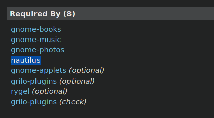

While trying various desktop environments, I noticed an unusual process called `tracker3-miners` consuming high CPU usage. It was not burst consumption, it was consistently hitting 100% usage for hours. In order to find what package installed this tracker as its dependencies, I utilized `pactree`.

Apparently, `tracker3`, `tracker3-miners` or anything closely related to this package helps index files and directories in Gnome environment, specifically file browser.

I noticed that there are two ways to find the dependents or the dependencies of a package in Arch Linux, *offline* or *online* **method**.
<!--excerpt-->

### Offline Method (requires installation)

In order to install `pactree`, we cannot directly install it unless we compile and build the package manually however, it is available through package named `pacman-contrib`.

```bash
sudo pacman -S pacman-contrib
```

Once installed, we can check out the manual or quick instructions using `-h` flag or simply `man pactree`. One flag that I found to be very useful for my purpose was `-r`, it prints out reverse dependents of a package, exactly what we need. By default, it prints out all the dependencies for a specified package.

To find the reverse package dependents of `tracker3-miners`, we can simply run..

```bash
pactree -r tracker3-miners
```

The output of the previous command is as follows. From this output, we know that the package that utilizes high CPU usage was installed by `nautilus` and hence, `nautilus` is a problem.

```
tracker3-miners
└─nautilus
```
#### Alternative Offline Method

Simply trying to remove the package that you believe is problematic yields interesting response from `pacman`. 

```bash
sudo pacman -Rs tracker3-miners
```

Output

```
checking dependencies...
error: failed to prepare transaction (could not satisfy dependencies)
:: removing tracker3-miners breaks dependency 'tracker3-miners' required by nautilus
```

### Online Method (requires surfing the internet)

The other method, an online method is to search the package in [**Arch Linux's package database**](https://archlinux.org/packages/extra/x86_64/tracker3-miners/). If we scroll down a little, we can notice two neatly organized columns with titles - **Dependencies** and **Required By**.

In the **Required By** column, we can notice the package `nautilus`, the package I had installed, hence, I found the culprit.



Simply removing the package with `sudo pacman -Rs nautilus` fixed the problem. :sparkles: