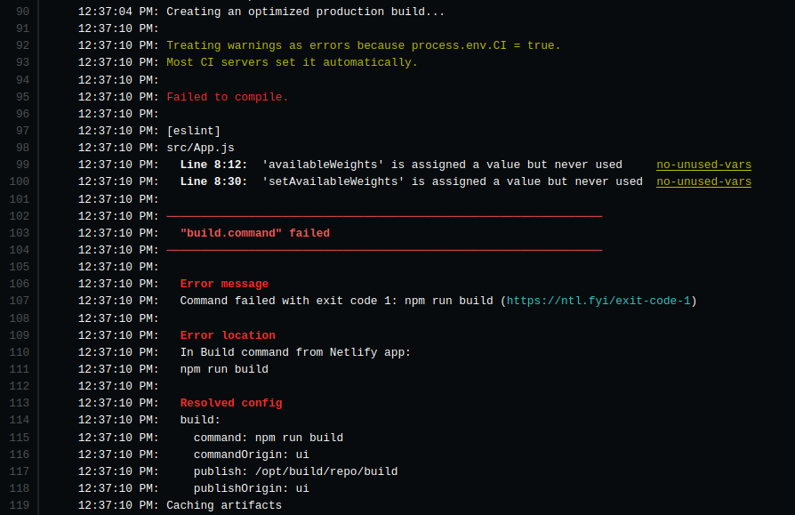

When I created a new React project and utilized Netlify to serve the website, I got thrown an error as such.

<!-- excerpt -->


```bash
12:37:10 PM: Treating warnings as errors because process.env.CI = true.
12:37:10 PM: Most CI servers set it automatically.
12:37:10 PM: 
12:37:10 PM: Failed to compile.
```

From this error, all I could understand was `process.env.CI = true` is causing the build to pick up warnings as errors. The fix seems pretty easy as Netlify provides an ability to configure build process.

### Fix

Head to **Netlify > Your Project > Site Settings > Build & deploy > Build settings > Build command.**

We need to pass `CI=false` and follow up with our build command.

For example, for my React project, default build command is `npm run build` but after adding `CI=false`, it would be as such.

```bash
CI=false npm run build
```